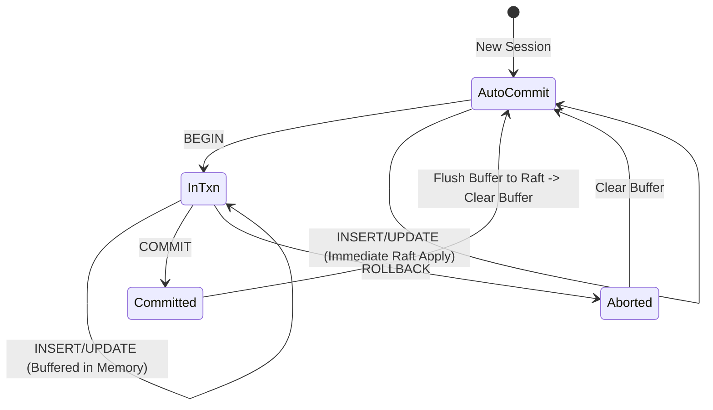

# System Design Specification: Aether (v0.1.0)

## Distributed Relational Store with PostgreSQL Wire Compatibility

| Field | Value |
| :--- | :--- |
| **Project Code** | **AETHER** |
| **Version** | v0.1.0-alpha (Genesis) |
| **Owner** | Aditya Mishra (`@bit2swaz`) |
| **Classification** | CP System (Consistent, Partition Tolerant) |
| **Core Components** | `hashicorp/raft`, `mattn/go-sqlite3`, `jackc/pgproto3` |
| **Status** | **APPROVED FOR DEVELOPMENT** |

-----

## 1\. Executive Summary & Design Philosophy

**Aether** is a distributed SQL database that provides strong consistency guarantees over a cluster of unreliable nodes. It decouples the *storage engine* from the *interface*, allowing it to leverage the robustness of **SQLite** for on-disk storage while exposing the ubiquitous **PostgreSQL Wire Protocol** to clients.

### 1.1 The "Why"

Traditional distributed databases (CockroachDB, TiDB) are operationally complex and resource-heavy. SQLite is simple but fundamentally single-node. Aether bridges this gap, creating a "Serverless" database experience that supports:

1.  **Fault Tolerance:** Automatic leader election and failover ($N=3$ cluster survives 1 failure).
2.  **Ecosystem Compatibility:** Drop-in support for existing Postgres tools (`psql`, `pgx`, `DBeaver`).
3.  **Strict Serializability:** All nodes execute write operations in the exact same order via the Raft consensus log.

-----

## 2\. System Architecture

Aether follows a **Shared-Nothing Architecture**. Every node is identical binary-wise. Roles (Leader, Follower, Candidate) are determined dynamically by the Raft algorithm.

### 2.1 The "Layer Cake" Architecture

```mermaid
graph TD
    subgraph "Interface Layer (The Mask)"
        TCP[TCP Listener :5432] --> Handshake[PG Handshake]
        Handshake --> Parser[PG Protocol Parser]
        Parser --> TxnMgr[Transaction Manager]
    end

    subgraph "Consensus Layer (The Brain)"
        TxnMgr -->|Atomic Batch| RaftLog[Raft Log]
        RaftLog -->|Replicate| Peers[Raft Peers]
    end

    subgraph "Storage Layer (The Memory)"
        RaftLog -->|Committed Entry| FSM[Finite State Machine]
        FSM -->|Apply| SQLite[SQLite Engine (WAL)]
    end
```

### 2.2 Data Flow: The Write Path

1.  **Ingest:** A `Q` (Query) packet arrives at the Leader node.
2.  **Transact:** The `Transaction Manager` determines if this is a standalone query or part of an open transaction buffer.
3.  **Propose:** Once ready to commit, the SQL is serialized into a `LogCommand` and passed to `Raft.Apply()`.
4.  **Consensus:** The Leader broadcasts `AppendEntries` RPCs to Followers.
5.  **Commit:** Once a quorum ($N/2 + 1$) acknowledges, the entry is committed.
6.  **Apply:** The `FSM` executes the SQL against the local `aether.db` file.
7.  **Response:** The result is captured, mapped to Postgres types, and sent back via TCP.

-----

## 3\. Component Design: Interface Layer

This layer is responsible for emulating a PostgreSQL server. It must effectively "lie" to the client, claiming to be Postgres while translating intents to SQLite.

### 3.1 Network Protocol (`pgproto3`)

We implement a custom TCP handler that strictly enforces the PostgreSQL v3.0 messaging flow.

  * **Startup:**
      * Client sends `StartupMessage` (Protocol 3.0).
      * Aether responds `AuthenticationOk` (0) -\> `ParameterStatus` -\> `ReadyForQuery`.
  * **Simple Query:**
      * Client sends `Q` (SQL string).
      * Aether responds `RowDescription` (Columns) -\> `DataRow` (N times) -\> `CommandComplete`.
  * **Termination:**
      * Client sends `X`. Aether closes connection.

### 3.2 The Type Mapper

SQLite is loosely typed; Postgres is strictly typed. To prevent client crashes, Aether uses a static mapping strategy during the `RowDescription` phase.

| SQLite Detected Type | Go Intermediate | PostgreSQL OID (Sent) | Type Name |
| :--- | :--- | :--- | :--- |
| `INTEGER`, `INT` | `int64` | **20** | `int8` |
| `REAL`, `FLOAT` | `float64` | **701** | `float8` |
| `TEXT`, `VARCHAR` | `string` | **25** | `text` |
| `BLOB` | `[]byte` | **17** | `bytea` |
| `NULL` | `nil` | **-1** | `null` |

**Design Decision:** If SQLite returns a type Aether doesn't recognize (e.g., a complex date string), default to OID 25 (`text`).

-----

## 4\. Component Design: Transaction Manager (ACID)

Since Raft logs are linear and immutable, we cannot interleave partial transactions from multiple clients. Aether implements **Session-Based Client-Side Buffering**.

### 4.1 Transaction Lifecycle State Machine



### 4.2 Implementation Logic

The `TxnMgr` maintains a `map[uint32]*Session`, where key is the Connection ID.

1.  **BEGIN:** Marks session as `InTxn`. Returns `CommandComplete`. **No network traffic to Raft.**
2.  **Write (InTxn):** Appends SQL string to `Session.Buffer`. Returns `CommandComplete`. **No network traffic to Raft.**
3.  **COMMIT:**
      * Wraps the entire buffer into a single `LogCommand{Type: BATCH, SQLs: [...]}`.
      * Calls `Raft.Apply()`.
      * Waits for FSM to execute the *entire* batch inside a generic SQLite transaction.
      * Returns result.
4.  **ROLLBACK:** Deletes `Session.Buffer`. Returns `CommandComplete`.

-----

## 5\. Component Design: Storage & Consensus

### 5.1 The Log Entry Structure

To ensure determinism and support batching, the Raft log stores a structured command, not raw bytes.

```go
type CommandType uint8

const (
    CmdExecute CommandType = iota // AutoCommit (Single Stmt)
    CmdBatch                      // COMMIT (Batched Stmts)
)

type LogCommand struct {
    Type      CommandType
    SQL       string   // Used if CmdExecute
    Batch     []string // Used if CmdBatch
}
```

### 5.2 Determinism Enforcement

**Critical Rule:** Every node must reach the exact same state.
**The Rewriter:** Before submitting to Raft, the system checks for non-deterministic tokens.

  * **Prohibited:** `RANDOM()`, `CURRENT_TIME`, `NOW()`.
  * **Action:** If detected, return Error `0A000` (Feature Not Supported) to client.
  * **Workaround:** User must supply UUIDs and Timestamps as literals in the SQL string.

### 5.3 Snapshotting Strategy (`VACUUM INTO`)

Standard file copying is unsafe because the FSM keeps the SQLite file open in WAL mode.

  * **Trigger:** Raft log exceeds `SnapshotThreshold` (e.g., 8192 entries).
  * **Action:**
    1.  The FSM executes SQL: `VACUUM INTO 'snapshot_temp.db'`.
    2.  This leverages SQLite's internal backup API to create a consistent copy without locking the main DB for writes.
    3.  Aether opens `snapshot_temp.db`, streams it to the snapshot sink, and deletes the temp file.

-----

## 6\. Development Roadmap (0 to Gold)

### Phase 1: The "Hollow" Server (Days 1-3)

**Objective:** Establish the Network Layer on Fedora.

  * [ ] **Env:** Setup Fedora, install `gcc`, `go`, `sqlite-devel`.
  * [ ] **Net:** Create TCP listener on `:5432`.
  * [ ] **Proto:** Implement `StartupMessage` handshake using `pgproto3`.
  * [ ] **Mock:** Accept `Q` message, log it, return a hardcoded `DataRow`.
  * [ ] **Verification:** Connect using `psql`. It should print the hardcoded row.

### Phase 2: The Storage Engine (Days 4-6)

**Objective:** Replace Mock with SQLite.

  * [ ] **DB:** Integrate `mattn/go-sqlite3`. Init with `_journal_mode=WAL`.
  * [ ] **Mapper:** Implement OID type mapping (Int -\> Int8, etc.).
  * [ ] **Exec:** Wire the Protocol Parser directly to `db.Exec`.
  * [ ] **Verification:** Create a table via `psql`. Insert data. Restart server. Verify data persists.

### Phase 3: The Consensus Cluster (Days 7-10)

**Objective:** Integrate Raft.

  * [ ] **Raft Init:** Setup `hashicorp/raft` with `boltdb` log store.
  * [ ] **FSM:** Move SQLite logic into `FSM.Apply()`.
  * [ ] **Wiring:** Network Layer now calls `Raft.Apply()` instead of `db.Exec()`.
  * [ ] **Bootstrap:** Implement a CLI flag `--join` to form a cluster.
  * [ ] **Verification:** Run 3 nodes. Write to Leader. Kill Leader. Verify Followers have data.

### Phase 4: ACID & Polish (Days 11-14)

**Objective:** Transactions and Snapshotting.

  * [ ] **TxnMgr:** Implement the Session Buffer logic (`BEGIN`/`COMMIT`).
  * [ ] **Snapshots:** Implement `VACUUM INTO` logic in `FSM.Snapshot()`.
  * [ ] **Determinism:** Add regex check for `RANDOM()`.
  * [ ] **Final Test:** Run a chaotic workload (concurrent writes + node kills) and verify integrity.

-----

## 7\. Configuration & Environment

### 7.1 Fedora Setup Commands

Since you are switching OS, run this immediately after install:

```bash
# 1. Update System
sudo dnf update -y

# 2. Install Dev Tools (CGO requirements)
sudo dnf groupinstall "C Development Tools and Libraries"

# 3. Install Specific Libs
sudo dnf install golang sqlite-devel wireshark

# 4. Firewall (Allow Raft & PG ports)
sudo firewall-cmd --permanent --add-port=5432/tcp
sudo firewall-cmd --permanent --add-port=9000-9003/tcp
sudo firewall-cmd --reload
```

### 7.2 Directory Structure

```
aether/
├── cmd/
│   └── aether/       # Main entry point
├── internal/
│   ├── server/       # PG Protocol Frontend
│   ├── consensus/    # Raft wrapper
│   ├── fsm/          # SQLite FSM & Snapshotting
│   ├── transactor/   # Txn Buffer Logic
│   └── sql/          # Determinism rewriter
└── go.mod
```

-----

## 8\. Failure Modes & Recovery

| Scenario | Behavior | Recovery |
| :--- | :--- | :--- |
| **Leader Crash** | Followers detect timeout (Heartbeat missing). New election triggered. | Automatic (Clients see "Connection Closed" and must reconnect). |
| **Follower Crash** | Leader retries `AppendEntries` indefinitely. | When Follower returns, it catches up via logs or Snapshot. |
| **Network Partition** | Minority partition cannot commit writes. Majority continues. | Partition heals; minority nodes step down and sync with majority. |
| **Disk Corruption** | SQLite returns `SQLITE_CORRUPT`. | **Panic**. Node must be wiped and re-joined as a fresh member. |

-----

## 9\. Future Work (v0.2.0+)

  * **Read-Replicas:** Allow `SELECT` on Followers (requires `ReadIndex` implementation for consistency).
  * **PG Auth:** Support MD5/SCRAM authentication.
  * **Prepared Statements:** Support `Parse`/`Bind`/`Execute` flow.
  * **Dynamic Membership:** Add/Remove nodes at runtime without restart.
