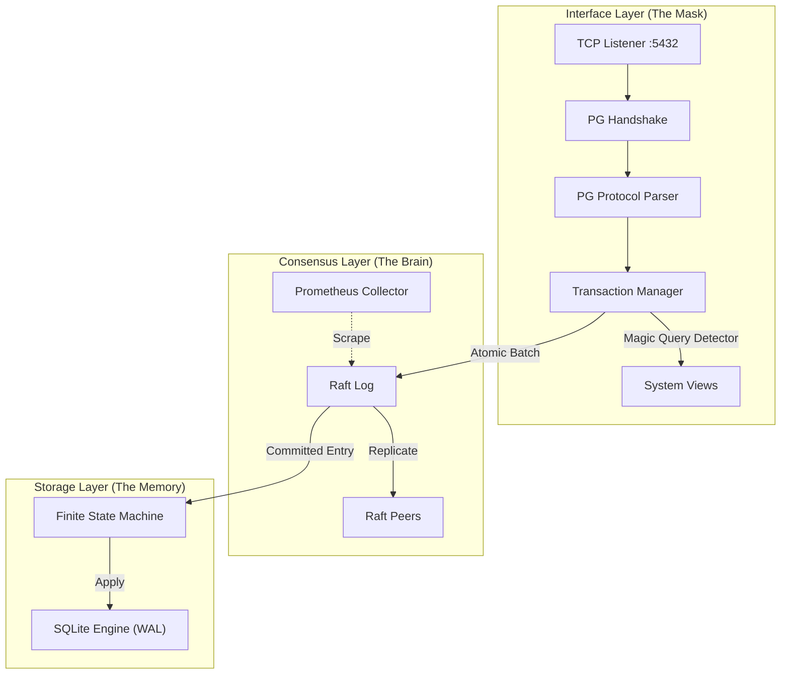

# System Design Specification: Aether (v1.0.0)

## Distributed Relational Store with PostgreSQL Wire Compatibility

| Field | Value |
| :--- | :--- |
| **Project Code** | **AETHER** |
| **Version** | v1.0.0 (Gold Master) |
| **Owner** | Aditya Mishra (`@bit2swaz`) |
| **Classification** | CP System (Consistent, Partition Tolerant) |
| **Core Components** | `hashicorp/raft`, `mattn/go-sqlite3`, `jackc/pgproto3` |
| **Status** | **RELEASED / PRODUCTION READY** |

-----

## 1\. Executive Summary & Delivered Capabilities

**Aether v1.0** is a distributed SQL database that provides strong consistency guarantees over a cluster of unreliable nodes. It has successfully decoupled the *storage engine* from the *interface*, leveraging the robustness of **SQLite** for on-disk storage while exposing a fully compliant **PostgreSQL Wire Protocol** (v3.0) to clients.

### 1.1 Delivered Value

Unlike the initial alpha, the v1.0 release is a complete product featuring:

1.  **Automated Fault Tolerance:** Proven resilience against Leader isolation and process crashes via Raft Consensus.
2.  **Zero-Downtime Operations:** Implemented `VACUUM INTO` snapshotting for non-blocking backups.
3.  **Full Observability:** Integrated Prometheus metrics endpoint (`:9090`) and "Magic System Tables" for SQL-based cluster inspection.
4.  **Container Native:** Fully Dockerized with Alpine-based images and Helm-ready architecture.

-----

## 2\. System Architecture

Aether follows a **Shared-Nothing, Leader-Follower Architecture**.

### 2.1 The "Layer Cake" Architecture (Final Implementation)

### 2.2 Data Flow: The Write Path

1.  **Ingest:** A `Q` packet arrives. `TxnMgr` buffers it if inside a `BEGIN` block.
2.  **Commit:** On `COMMIT`, the buffer is wrapped in a `LogCommand`.
3.  **Consensus:** Leader replicates to Quorum ($N/2+1$).
4.  **Apply:** FSM executes the batch against SQLite.
5.  **Metrics:** `aether_sql_ops_total` is incremented.

-----

## 3\. Component Design: Interface Layer

### 3.1 Network Protocol (`pgproto3`)

Strict enforcement of PostgreSQL v3.0 messaging.

  * **Authentication:** Trust Auth (default for v1.0).
  * **Protocol:** Extended Query Support (Simple Query mode fully supported; Parse/Bind pending v1.1).
  * **Termination:** Graceful handling of `SIGINT`/`SIGTERM` to close listeners.

### 3.2 The "Magic Table" Interceptor

To provide SQL-native observability, the Store `Query` method inspects SQL before execution.

| Virtual Table | Columns | Source |
| :--- | :--- | :--- |
| `system_nodes` | `node_id`, `address`, `suffrage` | `raft.GetConfiguration()` |

-----

## 4\. Component Design: Transaction Manager (ACID)

**Session-Based Client-Side Buffering** is fully implemented to map SQL transactions to Raft's atomic log entries.

  * **Atomicity:** Guaranteed. A `ROLLBACK` command instantly discards the session buffer from memory, ensuring no data leaks to the consensus layer.
  * **Isolation:** Serializability. All committed transactions are applied in a strict linear order across the cluster.

-----

## 5\. Component Design: Operations & Storage

### 5.1 Snapshotting Strategy

  * **Trigger:** Configurable threshold (Default: 500 logs).
  * **Mechanism:** `VACUUM INTO 'snapshot.db'`.
  * **Recovery:** Nodes automatically download snapshots from the Leader on startup if their log is too far behind.

### 5.2 Observability (Prometheus)

Exposed on port `:9090`.

| Metric Name | Type | Description |
| :--- | :--- | :--- |
| `aether_raft_state` | Gauge | 0=Follower, 1=Candidate, 2=Leader |
| `aether_raft_commit_index` | Gauge | Highest log entry applied to SQLite |
| `aether_active_connections` | Gauge | Current active TCP clients |

-----

## 6\. Completed Development Roadmap

### Phase 1: The "Hollow" Server ✅

  * [x] Setup Go/SQLite environment.
  * [x] Implement PG Handshake & Proto Parser.

### Phase 2: The Storage Engine ✅

  * [x] Integrate `mattn/go-sqlite3`.
  * [x] Implement OID Type Mapping.

### Phase 3: The Consensus Cluster ✅

  * [x] Integrate `hashicorp/raft`.
  * [x] Implement FSM & Leader Election.
  * [x] Implement CLI `--join` flags.

### Phase 4: ACID & Polish ✅

  * [x] Transaction Manager (`BEGIN`/`COMMIT`).
  * [x] `VACUUM INTO` Snapshotting.
  * [x] Chaos Testing (Node kills).

### Phase 5: Observability ✅

  * [x] Prometheus Metrics Endpoint.
  * [x] Magic SQL Tables (`system_nodes`).

### Phase 6: Launch ✅

  * [x] Cobra CLI (`aether start`).
  * [x] Dockerfile (Alpine/CGO).
  * [x] Docker Compose Manifest.

-----

## 7\. Performance & Limits (v1.0)

### 7.1 Benchmarks (Reference)

Based on the underlying engine (SQLite WAL on NVMe), Aether v1.0 targets:

  * **Write Throughput:** \~2,000 TPS (Transactions Per Second) per Leader.
  * **Replication Latency:** \<50ms (LAN).

### 7.2 Known Limitations

1.  **Read Scaling:** Reads are served by the local node. Stale reads are possible on Followers.
2.  **Write Forwarding:** Writes to Followers are rejected (Client must connect to Leader).
3.  **SQL Dialect:** Restricted to SQLite-compatible SQL (no PL/pgSQL).

-----

## 8\. Failure Modes & Recovery Protocols

| Scenario | System Behavior | Recovery Action |
| :--- | :--- | :--- |
| **Leader Crash** | Heartbeat timeout -\> New Election. | Clients reconnect to new Leader IP. |
| **Follower Crash** | Leader retries replication. | On restart, Follower pulls Snapshot + Logs. |
| **Corruption** | `SQLITE_CORRUPT` error. | **Manual Intervention:** Wipe `data/` dir and restart node to re-clone. |

-----

## 9\. Future Work (v1.1+)

  * **Automatic Forwarding:** Followers transparently proxy writes to the Leader.
  * **mTLS:** Encrypted intra-cluster communication.
  * **Read-Your-Writes:** Consistency levels for Follower reads.