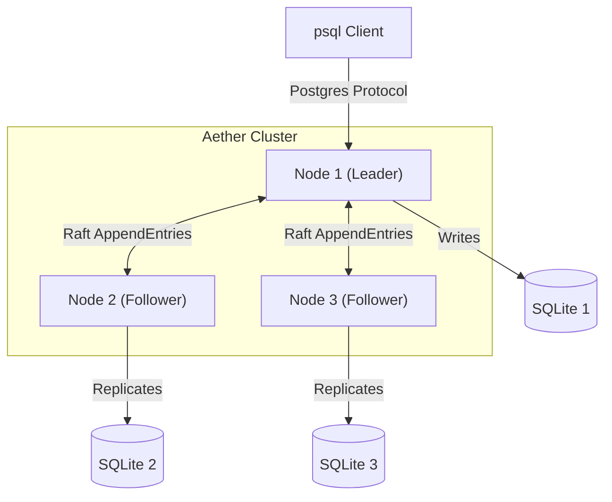

# Aether


**aether** is a distributed, relational database built from scratch in go.

it replicates **sqlite** databases across a cluster using the **raft consensus algo** and exposes a **postgresql wire protocol** interface. you can connect to it using standard tools like `psql`, `pgAdmin`, or any postgres client library.


## features

* **drop-in compatibility:** speaks the postgresql v3.0 wire protocol.
* **strong consistency:** uses hashicorp raft for leader-based consensus.
* **fault tolerant:** survives node failures. if the leader dies, a new one is elected automatically.
* **zero downtime snapshots:** uses sqlite's `VACUUM INTO` to snapshot data without locking for long periods.
* **observability:** built in prometheus metrics and "magic system tables" for cluster inspection.

##  architecture

aether follows a **leader-follower** architecture. writes are directed to the leader, replicated via raft logs, and applied to the underlying sqlite engine on all nodes.



## quick start (docker)

the easiest way to run aether is using docker compose. this spins up a 3-node cluster.

### option 1: docker compose (recommended)

create a `docker-compose.yml` file:

```yaml
version: '3.8'
services:
  node1:
    image: bit2swaz/aether:v1.0.0
    container_name: aether-node1
    hostname: node1
    command:
      - start
      - --id=node1
      - --port=5432
      - --raft-port=7000
      - --http-port=8080
      - --raft-advertise=node1:7000
    ports:
      - "5432:5432"   # PostgreSQL Port
      - "9090:9090"   # Prometheus Metrics
      - "8080:8080"   # Admin API
    volumes:
      - ./data/node1:/node1-data
    networks:
      - aether-network

  node2:
    image: bit2swaz/aether:v1.0.0
    container_name: aether-node2
    hostname: node2
    command:
      - start
      - --id=node2
      - --port=5432
      - --raft-port=7000
      - --http-port=8080
      - --join=http://node1:8080
      - --raft-advertise=node2:7000
    ports:
      - "5433:5432"
    volumes:
      - ./data/node2:/node2-data
    networks:
      - aether-network
    depends_on:
      - node1

  node3:
    image: bit2swaz/aether:v1.0.0
    container_name: aether-node3
    hostname: node3
    command:
      - start
      - --id=node3
      - --port=5432
      - --raft-port=7000
      - --http-port=8080
      - --join=http://node1:8080
      - --raft-advertise=node3:7000
    ports:
      - "5434:5432"
    volumes:
      - ./data/node3:/node3-data
    networks:
      - aether-network
    depends_on:
      - node1

networks:
  aether-network:
    driver: bridge
```

run the cluster:

```bash
docker-compose up -d
```

### option 2: docker single node

```bash
docker run -d --name aether \
  -p 5432:5432 -p 9090:9090 -p 8080:8080 \
  bit2swaz/aether:v1.0.0 start --id node1 --http-port 8080
```

## manual installation (binary)

if you prefer to run aether directly on your host machine (linux/macos):

1.  **download:** grab the latest tarball for your os from the [releases page](https://github.com/bit2swaz/aether/releases).
2.  **extract:**
    ```bash
    tar -xvf aether-v1.0.0-linux-amd64.tar.gz
    cd aether-v1.0.0-linux-amd64
    ```
3.  **run:**
    ```bash
    # start the leader
    ./aether start --id node1 --port 5432 --raft-port 7000 --http-port 8080
    ```

## connecting

connect using any postgresql client (user: `admin`, no password).

```bash
psql -h localhost -p 5432 -U admin postgres
```

**verify cluster topology:**
run this "magic query" to see the state of your raft cluster:

```sql
SELECT * FROM system_nodes;
```

## observability

aether exposes internal metrics for monitoring.

  * **prometheus metrics:** `get http://localhost:9090/metrics`
  * **cluster status:** `get http://localhost:8080/status`

**key metrics:**

  * `aether_raft_state`: 0=follower, 2=leader.
  * `aether_active_connections`: current tcp clients.
  * `aether_raft_commit_index`: replication progress.

## known limitations

aether v1.0 is an educational database engine. please note:

1.  **read consistency:** reads are currently served by the local node. stale reads are possible if a follower is disconnected from the leader.
2.  **write forwarding:** writes sent to a follower node will be rejected with an error. you must connect to the leader to write data.
3.  **sql support:** while it supports standard sql via sqlite, complex postgres-specific features (like pl/pgsql or stored procedures) are not supported.
4.  **security:** ssl/tls is currently disabled. do not expose this directly to the public internet.

## license

mit license. see [license](./LICENSE) for details.